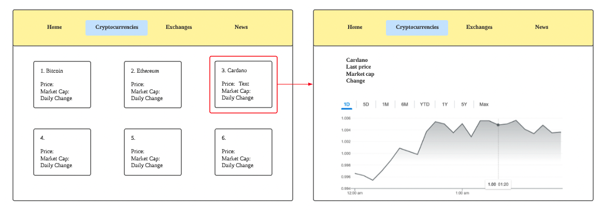

# Project-2-Cryptotracker

This web app is designed to track up to 100 popular cryptocurrencies

Wireframe

Technologies used:
1. React
2. Redux toolkit (RTK) for API
3. Ant design package for CSS
4. Chartjs

Planning and development:
The project originated from the istocks tutorial that was done in one of the lessons. I decided to replace stocks with cryptocurrencies as this is an area I have been looking at recently.

Problem solving strategy:
Troubleshoot based on notes, online resources and TAs

Unsolved problems:
Unable to convert timestamp from API to actual dates on chart

APIs used:
RapidApi, contains the data that I require
